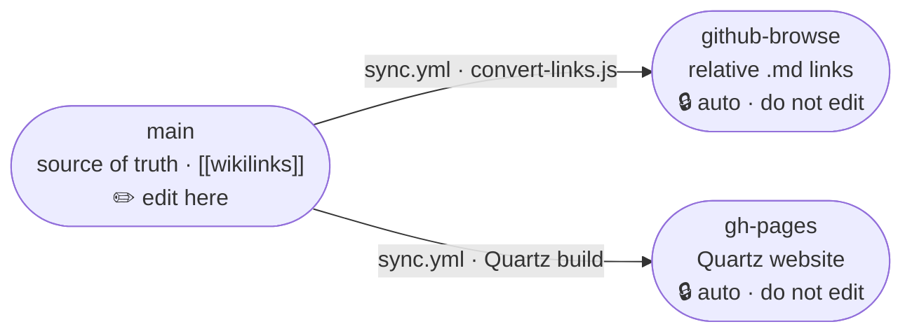

> [View this vault on the web](https://thisis-romar.github.io/grandma2-manual-vault) ·
> [Browse on GitHub](../../tree/github-browse)

# grandMA2 Manual Vault

[](https://github.com/thisis-romar/grandma2-manual-vault/actions/workflows/ci.yml)
[](https://github.com/thisis-romar/grandma2-manual-vault/actions/workflows/sync.yml)
[](https://thisis-romar.github.io/grandma2-manual-vault)

A standalone, self-contained Obsidian knowledge vault: the complete
[grandMA2 User Manual](https://help.malighting.com/grandMA2/en/help/) as interlinked notes —
browsable on GitHub and publishable as a static site. The scripts only build, link, and validate
the notes; the repository has no analytics or retrieval layer of its own.

**You are on `main` — the source of truth.** Links here are Obsidian `[[wikilinks]]`, meant to be
opened in Obsidian. To read with clickable links, use the
[github-browse](../../tree/github-browse) branch or the
[web edition](https://thisis-romar.github.io/grandma2-manual-vault) (see
[Branches](#branches-respective-context) below).

| Node type | Count |
|---|---|
| Sections | 55 |
| Pages | 374 |
| Keywords | 317 |
| Keys | 79 |
| Quick Start | 16 |

<sub>Counts are written automatically by `npm run stats`.</sub>

---

## How to Access

### Open in Obsidian (recommended for this branch)

```bash
git clone https://github.com/thisis-romar/grandma2-manual-vault.git
```

Open Obsidian → **Open folder as vault** → select the cloned folder. `[[wikilinks]]`, graph view,
and backlinks all work natively.

### Browse on GitHub

Switch to the **[github-browse](../../tree/github-browse)** branch — `[[wikilinks]]` are
auto-converted to relative markdown links so they resolve when clicked on GitHub.

### Browse on the web

**[thisis-romar.github.io/grandma2-manual-vault](https://thisis-romar.github.io/grandma2-manual-vault)**
— Quartz-powered, with full-text search and an interactive graph.

---

## Branches (respective context)

This repo serves the same vault through three surfaces. **You only ever edit `main`;** the other
two are regenerated automatically on every push by
[`.github/workflows/sync.yml`](.github/workflows/sync.yml).



| Branch | Audience & context | Link format | Edit here? | Status |
|---|---|---|---|---|
| [**`main`**](https://github.com/thisis-romar/grandma2-manual-vault/tree/main) | Source of truth — clone & open in **Obsidian** | `[[wikilinks]]` | ✅ yes | [](https://github.com/thisis-romar/grandma2-manual-vault/actions/workflows/ci.yml) |
| [**`github-browse`**](https://github.com/thisis-romar/grandma2-manual-vault/tree/github-browse) | Read clickable on **GitHub** (auto-generated mirror) | relative `.md` links | ❌ no — overwritten each sync | [](https://github.com/thisis-romar/grandma2-manual-vault/actions/workflows/sync.yml) |
| [**`gh-pages`**](https://github.com/thisis-romar/grandma2-manual-vault/tree/gh-pages) | The published **Quartz website** (search + graph) | rendered HTML | ❌ no — built from `main` | [site ↗](https://thisis-romar.github.io/grandma2-manual-vault) |

---

## Scripts

Requires **Node 22** (the `ci.yml` quality gate and the `github-browse` / `gh-pages` workflows all
run on Node 22).

**Build**

```bash
npm run obsidian        # scrape the MA help site and (re)generate the entire vault
```

**Maintain & validate**

```bash
npm run moc             # rebuild 000 Map of Content + keyword/key indexes (and stats)
npm run stats           # recount notes and write the stats tables (README + MOC)
npm run audit           # read-only conformance check (links, structure, frontmatter)
npm test                # unit tests (node --test)
```

**One-shot migrations** (idempotent; kept for reproducibility)

```bash
npm run links           # rewrite [[wikilinks]] → relative markdown (used for github-browse)
npm run migrate:links   # repair any raw key_*.html body links → [[wikilinks]]
npm run alias:sublinks  # add display aliases to path-qualified body wikilinks
```

**Develop**

```bash
npm run lint            # eslint (scripts)
npm run format          # prettier --write (scripts/config; vault markdown is excluded)
```

Husky hooks: **pre-commit** runs lint-staged, **commit-msg** enforces
[Conventional Commits](https://www.conventionalcommits.org/), **pre-push** runs tests + audit.
Quartz is pinned to **v4.5.2** — see [`CLAUDE.md`](CLAUDE.md) → Branch structure for build notes.

---

## Generated By

Extracted from [help.malighting.com/grandMA2](https://help.malighting.com/grandMA2/en/help/) by
`scripts/extract.js`. See [`CLAUDE.md`](CLAUDE.md) for the full structure, conventions, frontmatter
schema, and tooling reference.
